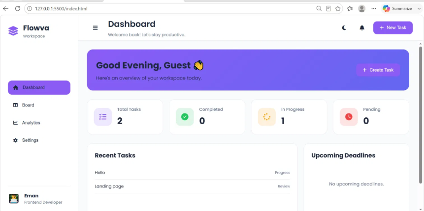
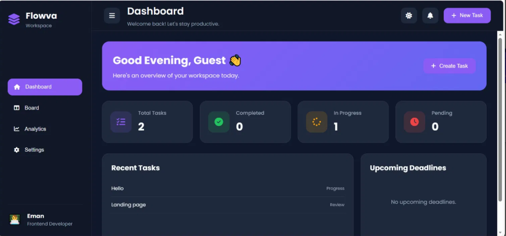
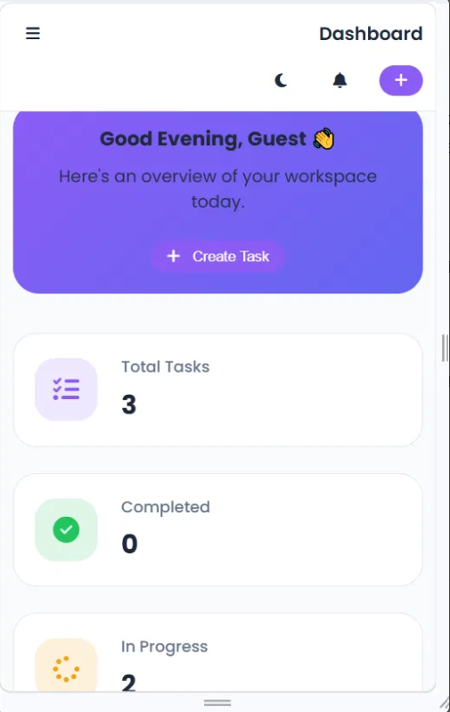

# 🌊 Flowva — Task Management Workspace

> A beautifully designed, fully client-side **Kanban-style task management app** built with vanilla HTML, CSS, and JavaScript. No frameworks, no backend, no dependencies — just clean, fast, and responsive productivity tooling right in your browser.

---
### Netlify live link:
https://flowva-app.netlify.app/

---

## 📸 Screenshots

### Dashboard — Light Mode


### Dashboard — Dark Mode


### Mobile View


---

## 📁 Project Structure
flowva/

│

├── index.html      # App structure, layout, all pages & modal markup

├── style.css       # Full styling — themes, layout, responsiveness

└── script.js       # All logic — tasks, drag & drop, routing, storage

The entire app lives in **three files** with zero build steps or external runtime dependencies.

---

## 🚀 Features

### 🏠 Dashboard
- **Welcome Banner** — Displays a time-aware greeting (Good Morning / Afternoon / Evening) with the user's saved name
- **Quick Stats Grid** — Four live-updating cards showing Total Tasks, Completed, In Progress, and Pending counts
- **Recent Tasks Panel** — Shows the last 5 tasks added, with their title and current status
- **Upcoming Deadlines Panel** — Reserved section for deadline-tracked tasks
- **Create Task Shortcut** — A prominent "+ Create Task" button right on the welcome banner

### 📋 Kanban Board
- **Four Columns** — Backlog → In Progress → Review → Done
- **Drag & Drop** — Cards are draggable between columns using the HTML5 Drag and Drop API; status updates automatically when a card is dropped
- **Live Column Counts** — Each column header badge shows the real-time number of tasks in that column
- **Edit Tasks** — Click the blue pen icon on any card to reopen the modal pre-filled with existing data
- **Delete Tasks** — Click the red trash icon to remove a task immediately with live UI update
- **Add New Task Button** — Available in the board header for quick access

### ➕ Task Modal (Add / Edit)
- **Task Title** — Required text input; saving is blocked if left empty
- **Description** — Optional textarea for notes or context
- **Status Selector** — Dropdown to place the task directly into Backlog, In Progress, Review, or Done
- **Save Task** — Creates a new task or updates an existing one depending on context
- **Modal Title Changes** — Shows "Add New Task" or "Edit Task" depending on the current action
- **Multiple Dismiss Options** — Close via the ✕ button, clicking outside the modal overlay, or saving

### 📊 Analytics
- **Summary Cards** — Mirrors the dashboard stats with a visual analytics layout (Total, Completed, In Progress, Pending)
- **Task Completion Bar** — A horizontal progress bar showing the percentage of tasks marked Done
- **Productivity Score Circle** — A circular badge displaying the same completion percentage as a visual score
- All analytics update in real time whenever tasks are added, moved, or deleted

### ⚙️ Settings
- **Profile Customization** — Set your full name and role (Frontend Developer, Backend Developer, Full Stack Developer, UI/UX Designer, Student, Freelancer); changes are reflected instantly in the sidebar profile section
- **Theme Toggle** — Switch between Light and Dark mode; preference is remembered across sessions
- **Clear All Tasks** — A danger button that wipes all tasks after a confirmation prompt; useful for resetting the workspace

### 🌙 Dark / Light Theme
- Full dark theme with a custom CSS variable set (`--bg`, `--card`, `--sidebar`, `--navbar`, `--text`, `--border`)
- Theme preference stored in `localStorage` and restored on every page load
- Toggle available in both the top navbar and the Settings page

### 📱 Fully Responsive
- Fluid grid layouts adapt from 4-column desktop all the way down to single-column mobile
- At ≤ 900px the sidebar collapses to icon-only mode
- At ≤ 576px the sidebar becomes a hidden drawer, toggled by the hamburger menu button
- All cards, modals, buttons, and text scale gracefully at every breakpoint (1400px → 1200px → 1024px → 900px → 768px → 576px → 400px)

---

## 🛠️ How It Works

### Page Routing
Navigation is entirely client-side. Each sidebar button carries a `data-page` attribute. On click, all `.page` sections are hidden and only the matching `#page-id` gets the `active` class. The top navbar title and subtitle also update to match the active page.

```js
const pageInfo = {
  dashboard: { title: "Dashboard", subtitle: "Welcome back! Let's stay productive." },
  board:     { title: "Board",     subtitle: "Manage your workflow using Kanban." },
  // ...
};
```

### Task Lifecycle

1. **Create** — User fills in title, optional description, and status, then clicks "Save Task". A task object `{ id, title, description, status }` is pushed into the `tasks` array.
2. **Render** — `renderTasks()` clears all four Kanban columns and re-renders every task card from scratch, sorting each card into the correct column based on `task.status`.
3. **Edit** — The edit button populates the modal fields with existing task data and sets `editTaskId`. On save, the matching task in the array is replaced by index.
4. **Delete** — The delete button filters the task out of the `tasks` array and calls `renderTasks()`.
5. **Persist** — After every mutation, `saveToLocalStorage()` stringifies the `tasks` array into `localStorage`. On load, `loadTasks()` restores and re-renders everything.

### Drag & Drop
Cards are rendered with `draggable="true"`. On `dragstart`, the card's ID is stored in `draggedTaskId`. The `dragover` handler prevents the default on any `.board-column` element to allow dropping. On `drop`, the card DOM node is appended to the target column's `.task-list`, and `task.status` is updated to match the target list's `id`.

### Data Persistence
All data is stored in the browser's `localStorage`:

| Key | Value |
|---|---|
| `tasks` | JSON array of all task objects |
| `theme` | `"light"` or `"dark"` |
| `profileName` | User's saved name string |
| `profileRole` | User's selected role string |

Data survives page refreshes and browser restarts. No server, no account, no sign-in required.

---

## 🎨 Design System

The app uses a CSS custom property system for theming:

| Variable | Light | Dark |
|---|---|---|
| `--bg` | `#F8FAFC` | `#0F172A` |
| `--card` | `#FFFFFF` | `#1E293B` |
| `--sidebar` | `#FFFFFF` | `#111827` |
| `--primary` | `#8B5CF6` | `#8B5CF6` |
| `--text` | `#1E293B` | `#F8FAFC` |
| `--text-light` | `#64748B` | `#94A3B8` |
| `--border` | `#E2E8F0` | `rgba(255,255,255,.08)` |

Typography is **Poppins** (via Google Fonts), with weights 300–700. Icons are **Font Awesome 6**.

---

## ⚡ Getting Started

No installation or build step needed.

1. Clone or download the repository:
```bash
git clone https://github.com/emanfatima4511-dot/To-Do-App.git
```

2. Open `index.html` directly in your browser, or use a local server:
```bash
# With VS Code Live Server (recommended)
# Right-click index.html → "Open with Live Server"

# Or with Python
python -m http.server 5500
```

3. Navigate to `http://127.0.0.1:5500/index.html`

That's it — no `npm install`, no build, no config files.

---

## 🧩 Tech Stack

| Technology | Purpose |
|---|---|
| **HTML5** | App structure, semantic markup, drag & drop API |
| **CSS3** | Custom properties, Grid, Flexbox, responsive breakpoints |
| **Vanilla JavaScript (ES6+)** | DOM manipulation, event handling, state management |
| **localStorage API** | Client-side data persistence |
| **Font Awesome 6** | Icons throughout the UI |
| **Google Fonts (Poppins)** | Typography |

---

## 🗺️ Pages at a Glance

| Page | Route (data-page) | Key Elements |
|---|---|---|
| Dashboard | `dashboard` | Welcome banner, stats grid, recent tasks, upcoming deadlines |
| Board | `board` | 4-column Kanban, drag & drop cards, add/edit/delete |
| Analytics | `analytics` | Stats cards, completion bar, productivity score circle |
| Settings | `settings` | Profile form, theme toggle, clear workspace |

---

## 🙋 Author

**Eman Fatima**
Frontend Developer

> Built as a clean, dependency-free productivity tool to demonstrate modern UI patterns using only vanilla web technologies.
